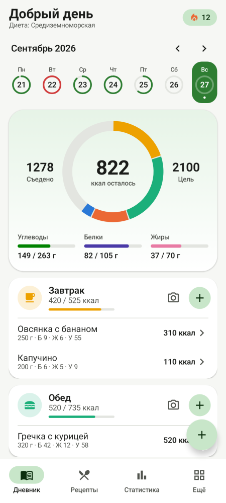
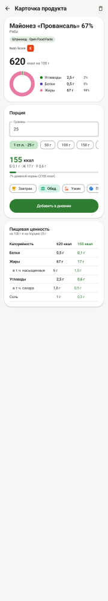
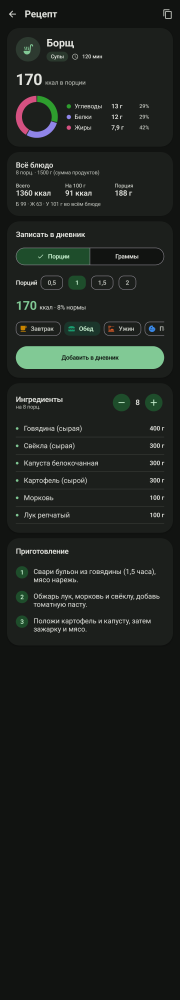
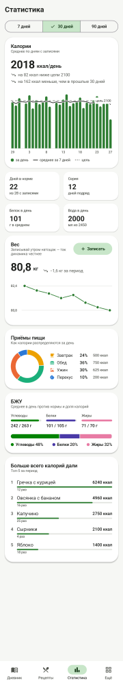
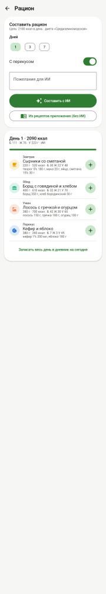
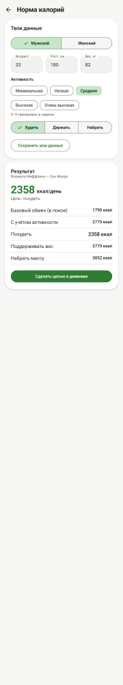

# CalorieTracker

Трекер калорий и БЖУ (в духе YAZIO) на Kotlin + Jetpack Compose.

## Возможности
- **Поиск сразу по нескольким базам** с фильтром по источнику:
  мои продукты → **Справочник РФ** (261 продукт русской кухни и магазина: майонез, сыры, вареники, окрошка, сушки…) →
  **USDA** (326 продуктов базы Минсельхоза США, переведены на русский, с клетчаткой, сахарами, солью) →
  **Open Food Facts** (магазинные товары с марками, ищется автоматически онлайн) → ИИ, если нигде нет
- **Дневник**: лента недели с мини-кольцами по дням, кольцо калорий по приёмам пищи, БЖУ по нормам активной диеты, вода, фото к приёму пищи, серия дней подряд
- **Диеты**: 11 готовых (сбалансированная, мягкое похудение, высокобелковая, низкоуглеводная, кето, средиземноморская, вегетарианская, веганская, 16:8, набор массы, DASH) и **конструктор своей** — БЖУ, калории к норме, число приёмов пищи, правила, список исключений. Активная диета задаёт нормы БЖУ, фильтрует рецепты, влияет на рацион и помечает неподходящие продукты
- **Рецепты**: 24 встроенных + свои; **калорийность всего блюда**, вес готового блюда, КБЖУ на 100 г и на порцию, запись порциями или граммами, редактирование и копирование встроенных
- **Рацион** на 1/3/7 дней — с ИИ или офлайн из рецептов, с учётом диеты
- **ИИ-ввод** через Groq: блюдо раскладывается на ингредиенты, найденные в справочниках пересчитываются по ним
- **Калькуляторы**: норма калорий, БЖУ, ИМТ, вода, % жира, идеальный вес, тренировки
- **Статистика** за 7/30/90 дней: скользящее среднее, сравнение периодов, вес, приёмы пищи, БЖУ, топ продуктов
- **Аккаунт и перенос**: резервная копия в zip-файл (с фото) и облачный аккаунт на Supabase с автосохранением
- **Онбординг** при первом запуске, заставка и иконка с логотипом, темы и Material You

## Скриншоты
| Дневник | Продукт | Рецепт (тёмная) |
|---|---|---|
|  |  |  |

| Статистика | Рацион | Калькулятор |
|---|---|---|
|  |  |  |

Скриншоты рендерятся без эмулятора через [Paparazzi](https://github.com/cashapp/paparazzi):
```
ANDROID_HOME=/путь/к/sdk ./gradlew recordPaparazziDebug   # перезаписать
ANDROID_HOME=/путь/к/sdk ./gradlew verifyPaparazziDebug   # сравнить с сохранёнными
ANDROID_HOME=/путь/к/sdk ./gradlew testDebugUnitTest       # все тесты: логика, база, миграция БД
```

Встроенная база и рецепты лежат в `app/src/main/assets/` (`foods_ru.json`, `recipes_ru.json`).
При изменении увеличь `SEED_VERSION` в `data/Seeder.kt` — приложение перезагрузит встроенные записи,
не трогая данные пользователя.

## Облачный аккаунт (Supabase)
Без настройки приложение работает, а перенос данных идёт через файл резервной копии.
Чтобы включить вход по email и облачное сохранение:
1. Создать бесплатный проект на [supabase.com](https://supabase.com)
2. В SQL Editor выполнить:
   ```sql
   create table public.backups (
     user_id uuid primary key references auth.users on delete cascade,
     data jsonb not null,
     updated_at timestamptz not null default now()
   );
   alter table public.backups enable row level security;
   create policy "own select" on public.backups for select using (auth.uid() = user_id);
   create policy "own insert" on public.backups for insert with check (auth.uid() = user_id);
   create policy "own update" on public.backups for update using (auth.uid() = user_id) with check (auth.uid() = user_id);
   create policy "own delete" on public.backups for delete using (auth.uid() = user_id);
   ```
3. Project Settings → API: скопировать **Project URL** и **anon public key** в файл `supabase.properties` в корне репозитория:
   ```
   url=https://xxxx.supabase.co
   anonKey=eyJ...
   ```
   anon-ключ публичный по замыслу Supabase (доступ ограничен политиками выше), его можно хранить в репозитории.
   Никогда не добавляй сюда `service_role` ключ.

## Сборка

Через Android Studio (самый простой способ):
1. File → Open → выбрать эту папку
2. Дать Android Studio подтянуть Gradle-обёртку и зависимости (нужен интернет)
3. Build → Build Bundle(s) / APK(s) → Build APK(s)
4. Готовый файл: `app/build/outputs/apk/debug/app-debug.apk`

Через терминал (нужен JDK 17+ и Android SDK, путь к SDK — в `local.properties` как `sdk.dir=...` или в `ANDROID_HOME`):
```
./gradlew assembleDebug
```

Через GitHub Actions (без установки чего-либо): при каждом пуше workflow `Build APK`
собирает release-APK (сжатый R8) и публикует его в **Releases** репозитория.
Последняя версия всегда по ссылке:
`https://github.com/spaiwer777-art/test/releases/latest/download/CalorieTracker.apk`

### Постоянный ключ подписи (чтобы обновления ставились поверх)
Без него каждая CI-сборка подписана новым одноразовым ключом, и перед установкой
новой версии старую придётся удалить (вместе с дневником). Один раз:
1. Создать ключ: `keytool -genkeypair -keystore release.jks -alias calorietracker -keyalg RSA -keysize 2048 -validity 10000`
2. В репозитории: Settings → Secrets and variables → Actions → New repository secret:
   - `SIGNING_KEYSTORE_BASE64` — вывод `base64 -w0 release.jks`
   - `SIGNING_STORE_PASSWORD`, `SIGNING_KEY_PASSWORD` — пароли из шага 1
   - `SIGNING_KEY_ALIAS` — `calorietracker`
3. Сам `release.jks` хранить у себя (не в репозитории) — он же понадобится для Google Play.

## Установка на телефон
1. Скачать `app-debug.apk` на телефон
2. Открыть файл и разрешить «Установку из неизвестных источников» для браузера/файлового менеджера
3. В приложении: ⚙ Настройки → вставить свой Groq API-ключ → «Сохранить ключ»

API-ключ не хранится в коде и репозитории — только локально на телефоне.

## Структура проекта
```
app/src/main/java/com/example/calorietracker/
  data/        Room-сущности, DAO, миграции, репозитории, настройки, калькуляторы,
               сопоставление ингредиентов ИИ со справочной базой, генератор рациона
  network/     Open Food Facts API, Groq API
  viewmodel/   ViewModel-ы экранов
  ui/          Compose-экраны и навигация
  ui/components/  кольцо калорий, полоски БЖУ, выбор приёма пищи
  ui/theme/    темы, акцентные цвета, цвета графиков
  MainActivity.kt
```

## Известные ограничения
- Нормы БЖУ в дневнике — пропорция 20/30/50 от цели; точный расчёт по весу — в калькуляторе «БЖУ под цель»
- Справочная база — средние значения; для конкретной марки точнее Open Food Facts или упаковка
- ИИ-оценка калорий приблизительная — точность зависит от модели Groq
