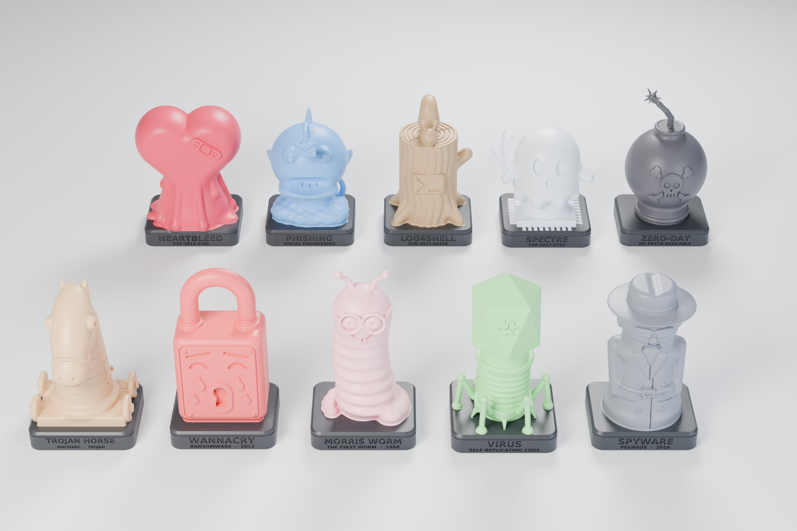
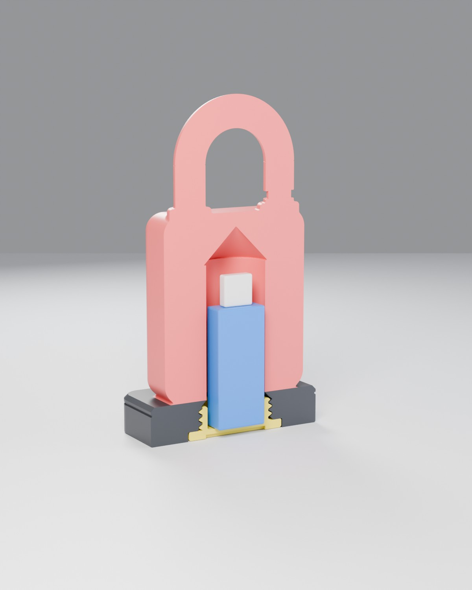

# Вирусы и уязвимости: 10 фигурок-тайников для флешки

Коллекция из 10 фигурок для 3D-печати. Каждая — известная угроза или уязвимость из мира
информационной безопасности. Внутри у каждой есть **тайник под USB-флешку**: он закрывается
снизу резьбовой крышкой, которая встаёт заподлицо с дном подставки.





| # | Фигурка | Что изображает | На подставке (перед / зад) |
|---|---------|----------------|----------------------------|
| 01 | **Trojan Horse** | Деревянный конь в стиле шахматного коня на тележке с колёсами; сбоку потайной люк — «полезная нагрузка» | TROJAN HORSE · MALWARE / A GIFT FOR YOU |
| 02 | **WannaCry** | Навесной замок-шифровальщик плачет, замочная скважина вместо рта | WANNACRY · RANSOMWARE 2017 / записка с требованием выкупа |
| 03 | **Morris Worm** | Пухлый червяк-ботаник в очках, хвост кольцом на подставке | MORRIS WORM · 1988 / 6000 HOSTS IN 24 HOURS |
| 04 | **Virus** | Бактериофаг: икосаэдрический капсид со знаком биологической опасности, хвост и шесть ножек | VIRUS · SELF-REPLICATING CODE / CREEPER · 1971 |
| 05 | **Spyware** | Шпион в плаще, шляпе и тёмных очках | SPYWARE · PEGASUS 2016 / I SEE EVERYTHING |
| 06 | **Heartbleed** | Пухлое сердце, «залатанное» пластырем, тает и растекается лужей крови | HEARTBLEED · CVE-2014-0160 / OPENSSL 2014 |
| 07 | **Phishing** | Рыба-удильщик на скале, вместо приманки — e-mail конверт | PHISHING · SOCIAL ENGINEERING / CLICK HERE TO WIN |
| 08 | **Log4Shell** | Бревно (log) с прибитой табличкой `>_`, по торцу ползёт улитка со своей раковиной (shell) | LOG4SHELL · CVE-2021-44228 / ${JNDI:LDAP://} |
| 09 | **Spectre** | Призрак с веточкой (branch prediction) поднимается из процессора | SPECTRE · CVE-2017-5753 / BRANCH PREDICTION IS A FEATURE |
| 10 | **Zero-Day** | Бомба с горящим фитилём, спереди череп, сзади перечёркнутый ноль | ZERO-DAY · NO PATCH AVAILABLE / DAYS SINCE DISCLOSURE: 0 |

Рендеры каждой фигурки лежат в [`renders/`](renders). Высота фигурок — 98–129 мм,
подставка — 72–76 × 58–66 мм.

## Файлы для печати (`stl/`)

| Файл | Сколько печатать |
|------|------------------|
| `01_trojan.stl` … `10_zeroday.stl` | по одной, это корпуса фигурок |
| `cap_x10.stl` | **10 штук**, крышка одна на все фигурки |
| `thread_test_ring.stl` | 1 штуку, по желанию: проверка резьбы перед печатью большой фигурки |

Все модели — замкнутые 2-manifold меши: одна оболочка, без дыр и самопересечений.
Это проверено скриптом `src/check_stl.py`. Единицы — миллиметры, ось Z направлена вверх.
Фигурки уже стоят в рабочей ориентации: дно подставки лежит в плоскости z = 0.

## Тайник

```
       ┌─╲ 45° купол (печатается без поддержек)
       │  │
       │  │  Ø25.4 × 63 мм — помещается флешка до 60 × 21 × 10.5 мм
       │  │  (стандартная USB-A: Kingston DataTraveler, SanDisk Cruzer и т. п.)
   ════╡  ╞════  подставка
      ╔╧══╧╗   резьба M31.6 × 3 (трапеция 60°), 3 витка, зазор 0.25 мм
      ╚════╝   крышка-стакан с накаткой и шлицем под монету; встаёт заподлицо
```

* Флешка стоит вертикально внутри крышки-стаканчика. Чтобы её достать, переверните фигурку
  и открутите крышку монетой или пальцами: по бокам от крышки в дне есть выемки.
* Толщина стенок вокруг полости и резьбы везде не меньше 2 мм. Это проверяется
  автоматически, когда собирается каждая модель.
* Если флешка короче 45 мм, положите в полость кусочек поролона, чтобы она не гремела.

## Рекомендации по печати

**Лучшее качество — смола (MSLA, 0.03–0.05 мм).** Корпус ставьте с наклоном 15–30°, поддержки
делайте лёгкие. Обязательно оставьте дренажное отверстие: полость открыта снизу, так что смола
стечёт сама. Крышку печатайте горизонтально, фланцем на стол и без поддержек. Для смолы зазор
в резьбе можно уменьшить (см. «Параметры» ниже).

**FDM (сопло 0.4, а лучше 0.25 мм):**

| Параметр | Значение |
|----------|----------|
| Слой | 0.12 мм (фигурка), 0.16 мм (крышка) |
| Стенки | 3–4 периметра |
| Заполнение | 10–15 % (gyroid) |
| Поддержки | **древовидные (tree / organic)**, только от стола. Внутри полости поддержки не нужны: потолок полости — купол 45° |
| Ориентация | корпус стоит на подставке, как в файле; крышка — фланцем вниз |
| Материал | PLA / PLA Silk / PETG |

Что потребует поддержек: поля шляпы шпиона, «удочка» и конверт удильщика, ветка Spectre,
очки червяка, фитиль бомбы, уши и морда коня. Всё остальное печатается без них
либо с минимальными подпорками.

**Перед первой фигуркой напечатайте `thread_test_ring.stl` и одну крышку.** Если резьба
слишком тугая, отшлифуйте её или пересоберите модели с другим зазором (см. ниже).

### Покраска

Гравированные надписи на подставке удобно затереть акриловой краской: нанесите её и сотрите
излишки с поверхности. На рендерах подставка графитовая, а сама фигурка цветная. Для FDM
это легко сделать сменой филамента на высоте **15 мм** (пауза / `M600` на слое 15.0 мм) — именно
там проходит граница подставки.

## Как это сделано / как пересобрать

Модели полностью генерируются кодом из `src/`. Форма каждой фигурки описана как SDF
(функция расстояния со сглаженными булевыми операциями). Так получаются плавные «скульптурные»
переходы без швов. Дальше работает Blender.

```
src/sdf.py            мини-библиотека SDF + узкополосный marching cubes
src/common.py         общие размеры: тайник, резьба, крышка, подставка, проверка стенок
src/figures.py        10 фигурок
src/make_mesh.py      этап 1: SDF → плотный меш (шаг вокселя 0.2 мм) → build/*.ply
src/blender_build.py  этап 2 (Blender): децимация, гравировка надписей, нарезка внутренней
                      резьбы (точный boolean), очистка меша, крышка, тестовое кольцо, экспорт STL
src/check_stl.py      этап 3: независимая проверка STL (trimesh): замкнутость, одна оболочка
src/render.py         превью-рендеры (Cycles)
```

```bash
pip install numpy scipy scikit-image trimesh
cd infosec-figures/src
python3 make_mesh.py                     # все фигурки, или: python3 make_mesh.py trojan wannacry
blender -b --factory-startup -P blender_build.py -- --cap
python3 check_stl.py
blender -b --factory-startup -P render.py -- --group --cutaway 02_wannacry
```

Проверено на Blender 4.2 LTS и Python 3.13. Полная сборка занимает около 40 минут на 4 ядрах (этап 1 — ~13 мин, этап 2 — ~22 мин).

### Параметры

Всё, что связано с флешкой и резьбой, задаётся в `src/common.py`:

* `CLR_R`, `CLR_AX` — зазор резьбы (0.25 мм; для смолы подойдёт 0.15 мм, для «тугого» FDM — 0.3 мм);
* `CAV_R`, `CAV_TOP` — диаметр и высота полости;
* `TH_*`, `PITCH` — профиль резьбы.

После изменения запустите заново этапы 1–3.
